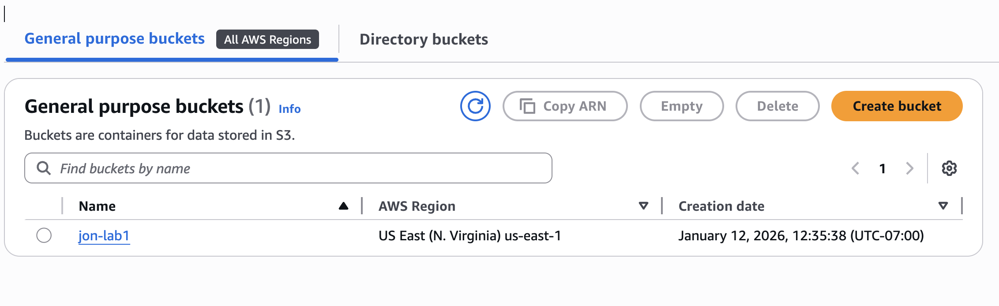
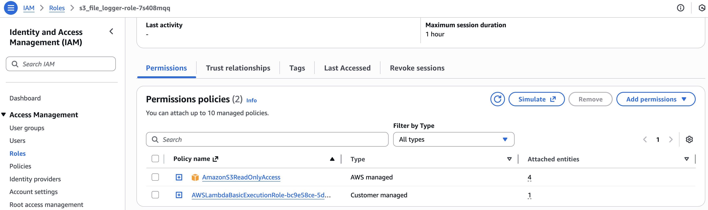
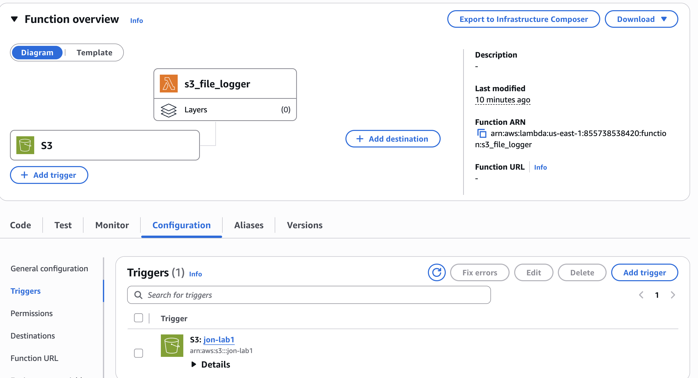
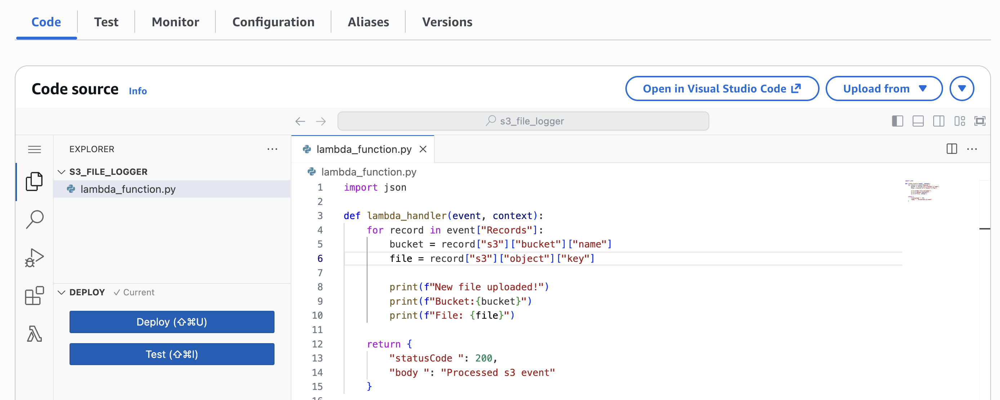
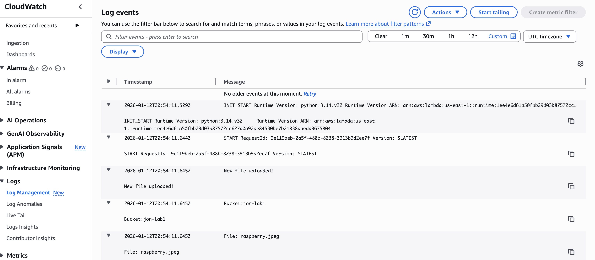

# AWS Lab 1 – S3 Triggered Lambda

## What this does

This project demonstrates a serverless, event-driven architecture built on AWS.
Whenever a file is uploaded into an Amazon S3 bucket, an AWS Lambda function is automatically triggered. The Lambda function reads the file metadata and logs the filename into Amazon CloudWatch.

This simulates how modern cloud systems react to events like file uploads, data ingestion, and user actions without running servers.

## Architecture

User Uploads File
↓
Amazon S3 Bucket
↓ (Event Trigger)
AWS Lambda Function
↓
Amazon CloudWatch Logs

## Technologies

- AWS S3 (Stores uploaded files)
- AWS Lambda (Runs code when a file is uploaded)
- IAM (Controls permissions between services)
- CloudWatch (Logs Lambda execution)
- Python (Lambda runtime language)

## What this lab proves

- Serverless architecture
- Event-driven design
- AWS IAM security
- CloudWatch monitoring
- Python automation
- Infrastructure-level integration

## Screenshots (Proof of Work)

### 1. S3 Bucket Created

### 2. Lambda Function

### 3.IAM Role for Lambda

### 4. S3 Trigger Configured

### 5. Test Upload to S3

### 6. CloudWatch Logs (Lambda Ran)

