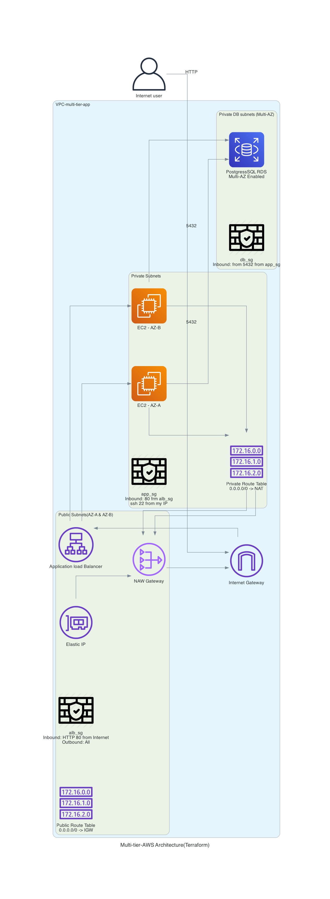

````markdown
# AWS Lab 5 — Terraform Multi-Tier AWS Architecture

## What this does

This lab provisions a **complete multi-tier AWS architecture using Terraform**.

Instead of manually building resources inside the AWS Console, all infrastructure is defined as code and deployed automatically using Infrastructure as Code (IaC).

A public Application Load Balancer distributes traffic across EC2 application servers running inside private subnets, while an Amazon RDS PostgreSQL database provides the backend database layer.

---

## Architecture

Internet → Application Load Balancer → EC2 Application Tier → PostgreSQL RDS Database → Private AWS Network

Terraform creates:

- Custom VPC
- Public subnets in **two Availability Zones**
- Private application subnets
- Private database subnets
- Internet Gateway
- NAT Gateway
- Route Tables
- Application Load Balancer
- Target Group + Listener
- EC2 Application Servers
- PostgreSQL RDS Database
- Security Groups
- Terraform Variables + Outputs

---

## Technologies Used

- Terraform
- AWS VPC
- Public & Private Subnets
- Internet Gateway
- NAT Gateway
- Route Tables
- Application Load Balancer (ALB)
- AWS EC2
- Amazon RDS (PostgreSQL)
- Security Groups
- Python Diagrams Library

---

## What this proves

- Infrastructure as Code (IaC)
- AWS networking fundamentals
- Multi-tier cloud architecture design
- Terraform resource management
- Secure AWS networking practices
- Load balancing concepts
- Database deployment in AWS
- Multi-AZ infrastructure deployment
- Cloud documentation and architecture visualization

---

## Screenshots (Proof of Work)

### 1. Terraform Apply Successful


### 2. VPC & Networking Resources Created


### 3. EC2 Application Tier Running


### 4. Application Load Balancer Created


### 5. Target Group Healthy


### 6. PostgreSQL RDS Database Created


### 7. Browser Access Through Load Balancer


### 8. Architecture Diagram



---

## Architecture Diagram

This project uses **Python's Diagrams library** to generate infrastructure diagrams directly from architectural design.

Diagram source code included:

```plaintext
lab5_diagram.py
```
````

---

## Future Improvements

Potential next improvements:

- Terraform Modules
- Auto Scaling Group (ASG)
- Launch Templates
- HTTPS / SSL Certificates
- Route53 DNS Integration
- CI/CD Pipeline Deployment
- CloudWatch Monitoring & Alerts

---

```

```
